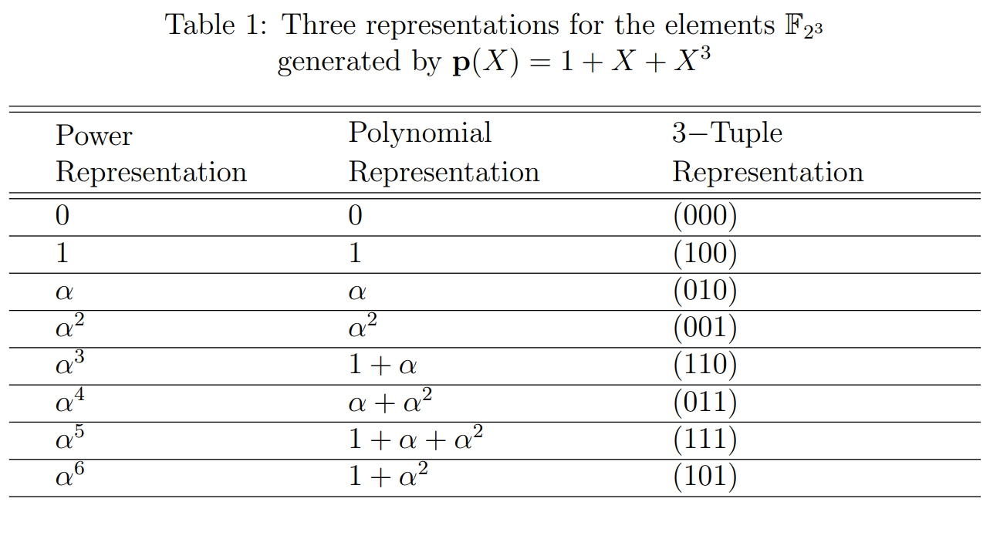

The theory is divided into three parts:

- Preliminaries
- Basics of MDS codes
- Construction of RS codes

### 1. Preliminaries

In this section, we will define a linearly independent set of vectors over the finite field $\mathbb{F}_{q}$ ($q = p^{m}$, $p$ prime, $m \geq 1$) and explain a method to determine whether a given set is linearly independent or not.
 
 
<b>Definition 1.</b> <i>(Linearly Independent set): A set of vectors
$ S = \{ \mathbf{v}_1 , \mathbf{v}\_2, \ldots, \mathbf{v}\_l \} \subset \mathbb{F}_{q}^n$ is said to be a linearly independent set if and only if $a_1\mathbf{v}_1 + a_2\mathbf{v}_2+ \ldots + a_l\mathbf{v}_l = \mathbf{0}$ can happen only when $a_1 = a_2 = \ldots = a_l = 0$.</i>
 
 
For example, suppose the set $S_1 = \bigl\{\mathbf{v}_1 = \begin{bmatrix} 3 & 4 & 2 \end{bmatrix}, \mathbf{v}_2 = \begin{bmatrix} 6 & 1 & 5 \end{bmatrix}$, $\mathbf{v}_3 = \begin{bmatrix} 0 & 1 & 6 \end{bmatrix} \bigr\} \subset \mathbb{F}_{7}^{3} $. The set $S_{1}$ is linearly independent since $a_1\mathbf{v}_1 + a_2\mathbf{v}_2+ a_3\mathbf{v}_3$ gives an all-zero vector only when we choose $a_1=a_2=a_3=0$. Whereas $S_2 = \bigl\{\mathbf{v}_1 = \begin{bmatrix} 2 & 1 & 3 \end{bmatrix}, \mathbf{v}_2 = \begin{bmatrix} 5 & 1 & 5 \end{bmatrix}$, $\mathbf{v}_3 = \begin{bmatrix} 1 & 2 & 4 \end{bmatrix} \bigr\} \subset \mathbb{F}_{7}^{3}$ is linearly dependent set since $4\mathbf{v}_1 + \mathbf{v}_2+ \mathbf{v}_3 = \mathbf{0}$.
 
 
Now we will provide a well-known procedure to determine the set is linearly independent or dependent.
 

- Write each vector of the set as a row of a matrix. Let's call this matrix A.
- Perform row operations on matrix A to convert it into its Reduced Row Echelon Form (RREF). Remember that arithmetic operations should be performed in the finite field $\mathbb{F}{q}$.
- Check if any row in the RREF of the matrix $A$ consists of all zeros. The set is linearly dependent if at least one row has all zeros.
- The set is linearly independent if no row contains all zeros.

Now with above-mentioned procedure we will check $S_{2} = \{\mathbf{v}_1 = \begin{bmatrix} 3 & 4 & 2 \end{bmatrix}, \mathbf{v}_2 = \begin{bmatrix} 6 & 0 & 5 \end{bmatrix}$, $\mathbf{v}_3 = \begin{bmatrix} 0 & 1 & 6 \end{bmatrix} 
 \} \subset \mathbb{F}_{7}^{3}$ is dependent. While carrying out the row operations, we represent the matrix rows with $R_{i}$ (where $i$ is the index of the row).

$$
\begin{align*}
    A = \begin{bmatrix}
        2 & 1 & 3 \\
        5 & 1 & 5 \\
        1 & 2 & 4
        \end{bmatrix}  \xRightarrow{R_{1} \leftarrow 4R_{1}} \begin{bmatrix}
        1 & 4 & 5 \\
        5 & 1 & 5 \\
        1 & 2 & 4
        \end{bmatrix}
        & \xRightarrow{R_{2} \leftarrow R_{2}+2R_{1}} \begin{bmatrix}
         1 & 4 & 5 \\
        0 & 2 & 1 \\
        1 & 2 & 4
        \end{bmatrix} \\ & \xRightarrow{R_{3} \leftarrow R_{3}+6R_{1}} \begin{bmatrix}
        1 & 4 & 5 \\
        0 & 2 & 1 \\
        0 & 5 & 6
        \end{bmatrix} \\ & \xRightarrow{R_{2} \leftarrow 4R_{2}} \begin{bmatrix}
        1 & 4 & 5 \\
        0 & 1 & 4 \\
        0 & 5 & 6
        \end{bmatrix}  \xRightarrow{R_{3} \leftarrow R_{3}+2R_{2}} \begin{bmatrix}
        1 & 4 & 5 \\
        0 & 1 & 4 \\
        0 & 0 & 0
        \end{bmatrix}.
\end{align*}
$$

The last row of the RREF form of the matrix $A$ has all zeros. Therefore, the set is linearly dependent, and the matrix's rank $A$ is 2.

### 2. Basics of MDS Codes

In this section, we define MDS codes and list a few important properties of these codes. MDS codes are a class of error-correcting codes that can correct a maximum number of errors for the given code rate (k/n). For any given code $\mathcal{C}(n,k)$, the upper bound on the minimum distance $d_{min}$ of the code is called a Singleton bound, which is as follows:

$$
\begin{equation}
    d_{min} \leq n-k+1.
\end{equation}
$$

Note that error-correcting capability depends upon the $d_{min}$, since the number of errors that the code can correct is equal to $\lfloor \frac{d_{min} -1}{2} \rfloor$ . So, the formal definition of MDS code is defined as follows:
 
 
<b>Definition 2</b>(MDS Code). <i> A code $\mathcal{C}(n,k)$ is called MDS code if the minimum distance achieves the Singleton bound (1), i.e., $d_{min}=n-k+1$.</i>
 
 
Now, We will describe a few properties of MDS codes without proof.

- A code $\mathcal{C}(n,k)$ is MDS, if and only if every set of $n-k$ columns of its parity check matrix $H$ are linearly independent.
- Dual code of an MDS code is MDS.
- Every set of $k$ columns of its generator matrix $G$ are linearly independent.

 
Below, we will provide generator matrices for a code with the parameters $(n=5, k=3)$, one of which generates an MDS code while the other one does not.

<b>Example 1.</b> <i>Let $$A = \begin{bmatrix} 
1 & 0 & 0 & 1 & 2  \\
0 & 1 & 0 & 0 & 1   \\
0 & 0 & 1 & 6 & 3   
\end{bmatrix},$$ where the elements of the matrix $A$ belong to the finite field $\mathbb{F}_{7}$. We can easily verify that columns 1,2 and 3 are linearly independent, and columns 1,3 and 4 are linearly dependent. Therefore, $A$ is the generator matrix of the code $\mathcal{C}(5,3)$ but it is not MDS.</i>
 
 
However, the matrix $$G = \begin{bmatrix} 
1 & 4 & 2 & 2 & 1 \\
1 & 1 & 6 & 1 & 6   \\
1 & 2 & 4 & 4 & 1   
\end{bmatrix}$$ generates the $\mathcal{C}(5,3)$ MDS code. Since every set of three columns of $G$ is linearly independent.

### 3. Construction of RS Codes

In this section, we will discuss the encoding procedure of RS codes.
 
 
<b>Definition 3</b>(Encoding of RS Codes): <i>Let $\alpha$ be a primitive element in $ \mathbb{F}_{p^{m}}$ and let $n \leq p^{m}-1$. Let $\mathbf{u} = \begin{bmatrix} u_0 & u_1 & \ldots & u_{k-1} \end{bmatrix}$ $\in \mathbb{F}_{p^{m}}^{k} $  be a message vector and let $\mathbf{u}(X) = u_{0} + u_{1}X+u_{2}X^{2}+ \ldots + u_{1}X^{k-1} \in \mathbb{F}_{p^{m}}[X]$ be its associated polynomial. Then the encoding is defined by the mapping $\sigma : \mathbf{u}(X) \mapsto \mathbf{v}$ by

$$
    \begin{equation}

        \mathbf{v} = \begin{bmatrix} v_0 & v_1 & \ldots & v_{n-1} \end{bmatrix} \triangleq \sigma (u(X)) = \begin{bmatrix}
    \mathbf{u}(\alpha_{1}) & \mathbf{u}(\alpha_{2}) & \ldots & \mathbf{u}(\alpha_{n})
        \end{bmatrix}.
    \end{equation}

$$

Here, $\alpha_1, \alpha_2, \ldots , \alpha_{n}$ are distinct elements chosen from $\mathbb{F}_{p^{m}}$ known as <b>evaluation set</b>. That is, $\sigma (u(X))$ evaluates $u(X)$ at all the elements of evaluation set $ \{ \alpha*1, \alpha_2, \ldots , \alpha*{n} \} \subseteq $ $\mathbb{F}_{p^{m}}$.
</i>
 
 
<b>Note 1.</b> <i>In the context of Reed-Solomon codes, an "evaluation set" is a set of distinct elements over the finite field used to evaluate the polynomial that represents the message to be encoded.</i>
 
 
The corresponding generator matrix of the RS code is as follows:

$$
\begin{equation}
\begin{aligned}
%
G =
%
\begin{bmatrix}
      1    & 1   & \ldots  & 1  \\
      \alpha_{1}     & \alpha_{2}   & \ldots   & \alpha_{n} \\
      \alpha_{1}^{2}     & \alpha_{2}^{2}   & \ldots   & \alpha_{n}^{2} \\
      \vdots &  &  \ddots  &      \\
      \alpha_{1}^{k-1}     & \alpha_{2}^{k-1}   & \ldots   & \alpha_{n}^{k-1} \\
    \end{bmatrix}.
%
\end{aligned}
%
\end{equation}
$$

Now we will verify that an $(n, k)$ RS code is MDS. Let $\mathbf{u} = \begin{bmatrix} u_0 & u_1 & \ldots & u_{k-1} \end{bmatrix} \neq 0$ is the message vector. The message polynomial $\mathbf{u}(X) = u_{0} + u_{1}X+u_{2}X^{2}+ \ldots + u_{k-1}X^{k-1} $ is a non-zero polynomial of degree at most $k-1$. Therefore, $\mathbf{u}(X)$ has at most $k-1$ roots, which implies $\mathbf{u} = \begin{bmatrix} u_0 & u_1 & \ldots & u_{k-1} \end{bmatrix}$ has at most $k-1$ zeros. From this, it is clear that each nonzero codeword has at most $k-1$ zeros. Thus $d_{min} \geq n-(k-1) = n-k+1$. However, by the Singleton bound \eqref{eq:sigleton*bound}, we must have $d*{min} \leq n-k+1 $. So $d_{min} =n-k+1$.

The following example illustrates the construction of $(6,3)$ RS code over the Galois field $\mathbb{F}_{2^{3}}$. The elements of $\mathbb{F}_{2^{3}}$ are given in Table 1.
 

    

 
<b>Example 2.</b> <i>A $(6, 3)$ RS code can be obtained by listing all polynomials of degree $2$ with coefficients in $\mathbb{F}_{2^{3}}$, and subsequently evaluating these polynomials at the chosen evaluation points from the finite field $\mathbb{F}_{2^{3}}$. Due to the Maximum Distance Separable (MDS) property of RS codes, the minimum distance $d_{\text{min}}$ is equal to $4$. Therefore, the code corrects one error.

Now we will illustrate an encoding of bit stream $ 010011111 $. Here $u_{0} = 010 = \alpha, u_{1} = 011 = \alpha^{4}, u_{2} = 111 = \alpha^{5} $ and the corresponding message polynomial is $ \mathbf{u}(X) = \alpha + \alpha^{4} X+ \alpha^{5} X^{2} \in \mathbb{F}_{2^{3}}[X]$.

For this example, there are $7$ possible evaluation sets. Here we demonstrate the encoding of the above message $\mathbf{u} = \begin{bmatrix} \alpha & \alpha^{4} & \alpha^{5} \end{bmatrix}$ for two different evaluation sets.

<b>1. For the evaluation set $ \{\alpha*{1} = \alpha, \alpha*{2} = \alpha^{2}, \ldots , \alpha*{6} = \alpha^{6} $ \}:</b>
Now the codeword of the given message $\mathbf{u} = \begin{bmatrix} \alpha & \alpha^{4} & \alpha^{5} \end{bmatrix}$ is obtained for the given evaluation set $ \alpha*{1} = \alpha, \alpha*{2} = \alpha^{2}, \ldots , \alpha*{6} = \alpha^{6} $ as follows:

$$
 \begin{align*}
     \mathbf{v} = \begin{bmatrix} v_{0} & v_{1} &  \ldots & v_{n-1} \end{bmatrix} & = \begin{bmatrix} \mathbf{u}(\alpha_{1})& \mathbf{u}(\alpha_{2}) & \ldots & \mathbf{u}(\alpha_{n}) \end{bmatrix}. \nonumber \\
        & = \begin{bmatrix}
            \mathbf{u}(\alpha) & \mathbf{u}(\alpha^{2}) & \mathbf{u}(\alpha^{3}) & \mathbf{u}(\alpha^{4}) & \mathbf{u}(\alpha^{5}) & \mathbf{u}(\alpha^{6})
        \end{bmatrix}.
 \end{align*}
$$

Using Table 1 we can evaluate the message polynomial $\mathbf{u}(X)$ at all evaluation points. For understanding, evaluation of message polynomial $ \mathbf{u}(X) = \alpha + \alpha^{4} X+ \alpha^{5} X^{2} $ is explained below for $i = 1, 2$:

$$
  \begin{align*}
      \mathbf{u}(\alpha) & = \alpha + \alpha^{4} \alpha + \alpha^{5} \alpha^{2} \\
      & = \alpha + \alpha^{5} + \alpha^{7}  \\
                         & = \alpha + (1+\alpha +\alpha^{2}) + 1     \\
                         & = \alpha^{2}.
  \end{align*}

   \begin{align*}
      \mathbf{u}(\alpha^{2}) & = \alpha + \alpha^{4} \alpha^{2} + \alpha^{5} \alpha^{4} \\
      & = \alpha + \alpha^{6} + \alpha^{9}  \\
                         & = \alpha + (1+\alpha^{2}) + \alpha^{2}    \\
                         & = 1 + \alpha = \alpha^{3}.
  \end{align*}
$$

Similarly, we can find for $i = 3, 4, 5, 6$. The codeword

$$
\begin{align*}
    \mathbf{v} = \begin{bmatrix} v_{0} & v_{1} &  \ldots & v_{n-1} \end{bmatrix} & = \begin{bmatrix} \mathbf{u}(\alpha_{1})& \mathbf{u}(\alpha_{2}) & \ldots & \mathbf{u}(\alpha_{n}) \end{bmatrix}. \nonumber \\
       & = \begin{bmatrix}
           \mathbf{u}(\alpha) & \mathbf{u}(\alpha^{2}) & \mathbf{u}(\alpha^{3}) & \mathbf{u}(\alpha^{4}) & \mathbf{u}(\alpha^{5}) & \mathbf{u}(\alpha^{6})
       \end{bmatrix} \\
            & = \begin{bmatrix}
                \alpha^{2} & \alpha^{3} & \alpha^{6} &\alpha^{6} & \alpha^{2} & \alpha
            \end{bmatrix}.
\end{align*}
$$

Hence the encoded bit stream of $ 010011111 $ is $001110101101001010$.

<b>2. For the evaluation set $ \{\alpha*{1} = 1, \alpha*{2} = \alpha^{}, \alpha*{3} = \alpha^{2} \ldots , \alpha*{6} = \alpha^{5} $ \}:</b>
Now the codeword of the given message $u = [\alpha, \alpha^{4}, \alpha^{5} ]$ is obtained for the given evaluation set $ \alpha*{1} = \alpha, \alpha*{2} = \alpha^{2}, \ldots , \alpha\_{6} = \alpha^{5} $ as follows:

$$
 \begin{align*}
     \mathbf{v} = \begin{bmatrix} v_{0} & v_{1} &  \ldots & v_{n-1} \end{bmatrix} & = \begin{bmatrix} \mathbf{u}(\alpha_{1})& \mathbf{u}(\alpha_{2}) & \ldots & \mathbf{u}(\alpha_{n}) \end{bmatrix}. \nonumber \\
        & = \begin{bmatrix}
            \mathbf{u}(1) & \mathbf{u}(\alpha) & \mathbf{u}(\alpha^{2}) & \mathbf{u}(\alpha^{3}) & \mathbf{u}(\alpha^{4}) & \mathbf{u}(\alpha^{5})
        \end{bmatrix} \\
             & = \begin{bmatrix}
                 \alpha^{3} & \alpha^{2} & \alpha^{3} & \alpha^{6} &\alpha^{6} & \alpha^{2}
             \end{bmatrix}.
 \end{align*}
$$

Hence the encoded bit stream of $ 010011111 $ is $110001110101101001$.
</i>
